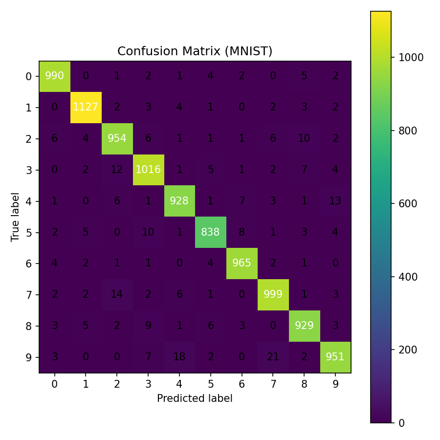

# MNIST Digits Classification — NumPy MLP 🔢🧠  
Multi-Layer Perceptron (MLP) with Backpropagation **from scratch in NumPy**.


---

## ✨ Overview  
This project implements a **Multi-Layer Perceptron (MLP)** for MNIST digit classification using only **NumPy**.  
It demonstrates end-to-end understanding of neural networks without frameworks: manual forward pass, backpropagation, and training loop.  

Includes professional-style **evaluation artifacts**: confusion matrix, per-class metrics, calibration (ECE), saliency maps, and a minimal model card.

---

## 🛠️ Workflow  
- Load & normalize MNIST CSV data → `[0.01, 1.0]`  
- One-hot encode labels  
- Initialize weights with Xavier  
- Forward pass (sigmoid → softmax)  
- Backpropagation (cross-entropy + L2 regularization)  
- Train with SGD + momentum + learning rate decay (optional early stopping)  
- Evaluate with accuracy, confusion matrix, precision/recall/F1  
- Save metrics + artifacts (plots, weights, configs)

---

## 📁 Repository Layout  
```bash
ai-mnist-mlp-fromscratch/
├─ notebooks/
│  └─ 01_mnist_mlp.ipynb        # full pipeline
├─ reports/
│  ├─ confusion_matrix.png
│  ├─ train_history.json
│  ├─ metrics.json
│  ├─ model_card.json
│  └─ config.json
├─ artifacts/
│  └─ mlp_weights_biases_1hidden.npz
├─ data/                        # CSVs or download script
├─ requirements.txt
└─ README.md
```

## 🚦 Quickstart
Run the Jupyter notebook:
```bash
jupyter notebook notebooks/01_mnist_mlp.ipynb
```

## 📊 Results (Held-Out Test Set)

| Metric                   | Value         |
|---------------------------|--------------:|
| Hidden Layers             | 1 × 256 logistic |
| Test Accuracy             | **97.64%**    |
| Correct Classifications   | 9,764         |
| Incorrect Classifications | 236           |
| Test Loss (cross-entropy) | ≈ 0.13–0.14   |





## 🔍 Features
- Manual forward & backward pass in NumPy
- SGD with momentum + LR decay
- Early stopping and L2 regularization
- Evaluation: confusion matrix, precision/recall/F1
- Reliability diagram + Expected Calibration Error (ECE)
- Saliency maps for explainability
- Model card in `reports/`

## 🔮 Roadmap
- Add 2-hidden-layer experiment
- Replace sigmoid → ReLU, try Adam optimizer
- Export ONNX + small inference demo

## 📜 License
MIT (see [LICENSE](LICENSE))

---
